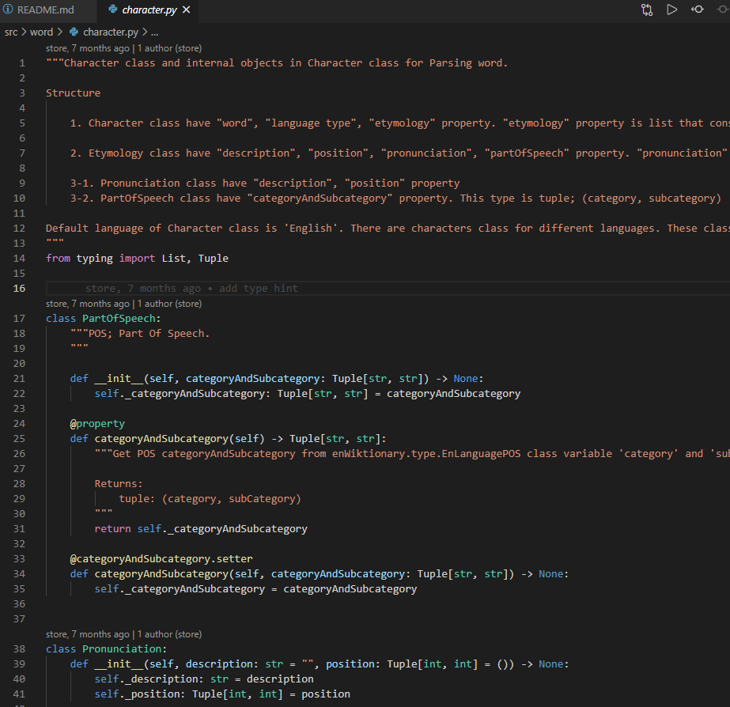

# **Word Crawling**

#
## Purposes
### 1. Select Python Virtual environment
    virtualenv, venv, Anaconda, pipenv
    - virtualenv
      Legacy library that has been used since python 2. 

    - venv
      A library included in the default module since python 3.3 

    - Anaconda
      A distribution of the Python and R programming languages for scientific computing (data science, machine learning applications, large-scale data processing, predictive analytics, etc.)
      //
      Reference
        [Wikipedia] (https://en.wikipedia.org/wiki/Anaconda_(Python_distribution))

    - pipenv
      It specializes in version control and compatibility of packages. It can show my dependency graph.
      So I select the pipenv.
      //
      Reference
        [PyPI] (https://pypi.org/project/pipenv/)

#
### 2. Crawling in en.wiktionary
    1. Static page
        Crawling on extension .xml file. The amount of data in en.wiktionary is very large.
        They distributed as xml file separately so I used them. 
        However, since it exceeds 10GB, I made a demo version file and tested it. 
        I knew I had to split the file in order to process quickly with multi-threading.
        However, this project has not been written that way.
        "src/enwiktionary/legacyParsing.py" is for the former and "src/enwiktionary/parsing.py" is for the latter. The latter has still not been updated.
        Files in "src/test" is main code for this.

    2. Dynamic page
        Crawling Using Selenium and ChromeDriver. For this, I used the site of the BTD6 game.
        Files in "src/etc" is main code for this.
    
#
### 3. Code arrangement
    1. Code formatter
      - autopep8, yapf, black
        There are several code formatters to make the code look pretty.
        But I choose "black" because I thought it was the best.
        I have the same opinion as the author in the link below.
        //
        Reference
          [Compare_Code_formatter] (https://www.kevinpeters.net/auto-formatters-for-python)

    2. Code checker
      - Pylint, Flake8
        I choose this because Flake8 is better at catching the error by searching several comments from the community site. 

#
### 4. Documentation
    I learned that documentation for maintenance is a very important process.
    There are several formats for documentation. 
    Among them, the format created by Google was the cleanest (*my opinion*), so I choose it.
    After that, I was able to create an orderly document by automatically making an html file in conjunction with Sphinx and ReadTheDocs. 
      //
      Reference
        [Compare_Documentation_Format] (https://stackoverflow.com/questions/3898572/what-is-the-standard-python-docstring-format)

#
#
## Example code
